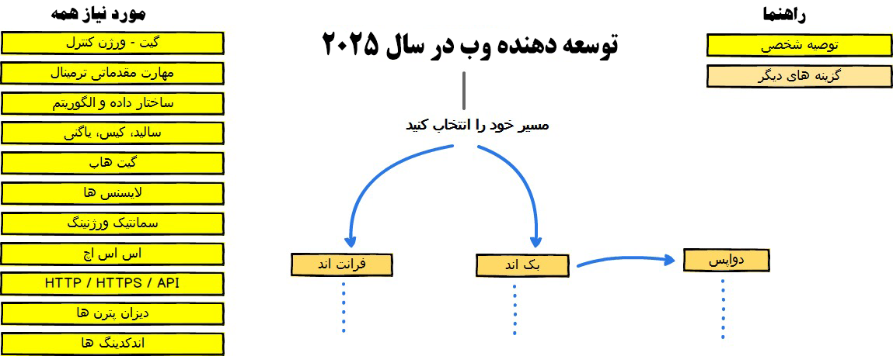
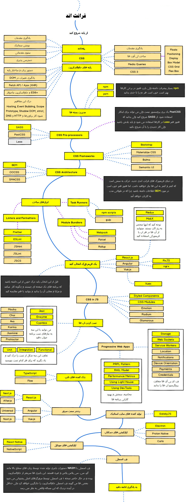
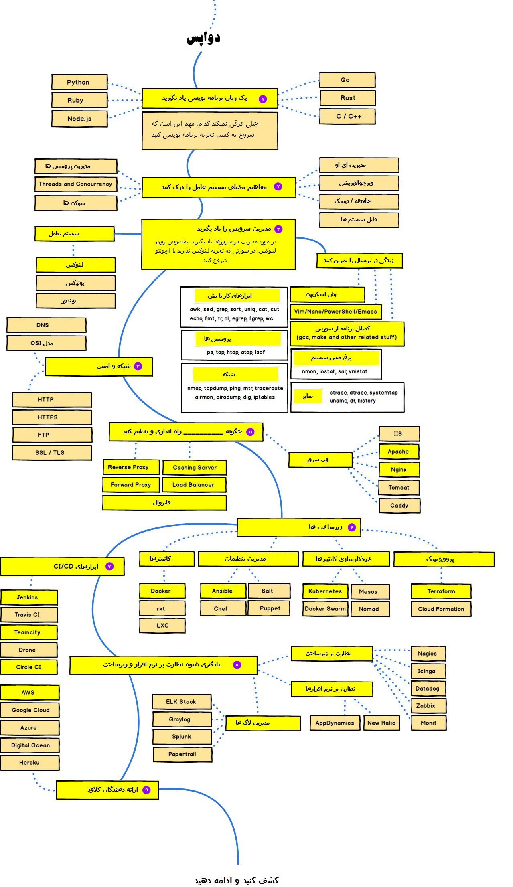

#### برای شروع برنامه نویسی از کجا باید شروع کنم؟ چه زبانی رو یاد بگیرم؟ ووو

شاید برای تو هم پیش آمده که بخوای برنامه نویسی رو شروع کنید.
اما ندونی از کجا و چطوری!
به همین دلیل یک نقشه راه برات اماده کردم تا بتونید بدون هیچ مشکلی این مسیر یادگیری قدم به قدم  طی کنی.
این نقشه راه شروع برنامه نویسی وب هست..

پس اگر به طراحی و توسعه وب علاقه داری نگاهی به این نقشه بنداز (ضرر نمیکنی 😉)

---

---

**Frontend**

آموزش ها و نکته های بیشتر (https://roadmap.sh/frontend)

---

**Backend**
آموزش ها و نکته های بیشتر (https://roadmap.sh/backend)

---

**Devops**

آموزش ها و نکته های بیشتر (https://roadmap.sh/devops)

---

برنامه‌نویسی مثل ساختن دنیای خودته! هر خط کد یک قدم به سمت هدفه.
ممکنه گاهی باگی بخوری یا کدت کار نکنه، اما همین چالش‌ها تو رو قوی‌تر می‌کنن. **توقف نکن، ادامه بده!** 🚀
