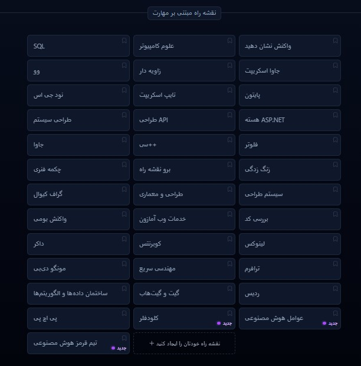

# نقشه‌های راه برنامه‌نویسی: راهنمایی که هر توسعه‌دهنده به آن نیاز دارد!  

یادت می‌آید وقتی تازه می‌خواستی برنامه‌نویسی رو شروع کنی، چقدر سردرگم بودی؟ من خودم کلی وقت گذاشتم تا بفهمم باید از کجا شروع کنم، چه چیزهایی رو یاد بگیرم و چطور جلو برم. خوشبختانه الآن یه راه حل عالی وجود داره که می‌تونه این مسیر رو برات ساده‌تر کنه.  

## یه سایت جادویی برای برنامه‌نویس‌ها  

تصور کن یه جایی وجود داره که صدها توسعه‌دهنده حرفه‌ای دور هم جمع شدن و تمام مسیرهای یادگیری برنامه‌نویسی رو به صورت مرحله‌به‌مرحله طراحی کردن. از فرانت‌اند و بک‌اند گرفته تا دواپس و هوش مصنوعی! اینجا دقیقاً همون جاییه که می‌تونی ببینی برای تبدیل شدن به یه متخصص واقعی، چه چیزهایی رو باید یاد بگیری و به چه ترتیبی.  

---

---

## چرا این سایت اینقدر خاصه؟  

- **رایگانه!** برخلاف خیلی از دوره‌های پولی، اینجا همه چیز رو مجانی گذاشتن.  
- **همیشه به‌روزه** چون جامعه توسعه‌دهنده‌ها دائم دارن محتوا رو آپدیت می‌کنن.  
- **کامل و عملی** — نه مثل بعضی مقالات پراکنده، اینجا همه چیز مرتب و منطقی چیده شده.  
- **تعاملیه** — می‌تونی پیشرفتت رو تیک بزنی و ببینی چقدر جلو رفتی.  

---

## خودت رو جای من بذار...  

فرض کن می‌خوای یه توسعه‌دهنده فرانت‌اند بشی. تو این سایت می‌بینی که اول باید HTML و CSS رو قوی کنی، بعد بری سراغ جاوااسکریپت، سپس فریمورک‌هایی مثل React یا Vue رو یاد بگیری و بعدش بری سراغ ابزارهای پیشرفته‌تر. هر مرحله هم کلی منبع آموزشی مفید داره که می‌تونی استفاده کنی.  

یا مثلاً اگر به دواپس علاقه داری، بهت می‌گه اول لینوکس رو یاد بگیر، بعد برو سراغ Docker و Kubernetes و بعدش مفاهیم CI/CD رو بفهم. دیگه لازم نیست کلی وقت بذاری تا بفهمی چیکار کنی — همه چیز از قبل مرتب شده!  

---

## این سایت چیه و چطور پیداش کنم؟  

اسمش **roadmap.sh** هست و می‌تونی با یه سرچ ساده تو گوگل پیداش کنی (یا مستقیماً بری به آدرس [https://roadmap.sh](https://roadmap.sh)). طراحی ساده و کاربرپسندی داره و می‌تونی تو کمتر از چند ثانیه مسیر مورد علاقه‌ات رو انتخاب کنی.  

## یه پیشنهاد جالب...  

اگر حس می‌کنی یه بخشی از نقشه راه‌ها کمبود داره یا می‌تونه بهتر بشه، حتی می‌تونی خودت مشارکت کنی! چون این پروژه **اوپن‌سورس** هست و هرکسی می‌تونه کمک کنه تا بهتر بشه.  

---

## حرف آخر  

اگر واقعاً به برنامه‌نویسی علاقه داری و می‌خوای بدون سردرگمی یاد بگیری، پیشنهاد می‌کنم همین الآن یه سر به **[roadmap.sh](https://roadmap.sh)** بزنی. مطمئنم مثل خیلی‌های دیگه (از جمله خودم!) بهت کمک می‌کنه مسیرت رو پیدا کنی.  

🚀 **برو ببینش:** [https://roadmap.sh](https://roadmap.sh)  

---  

