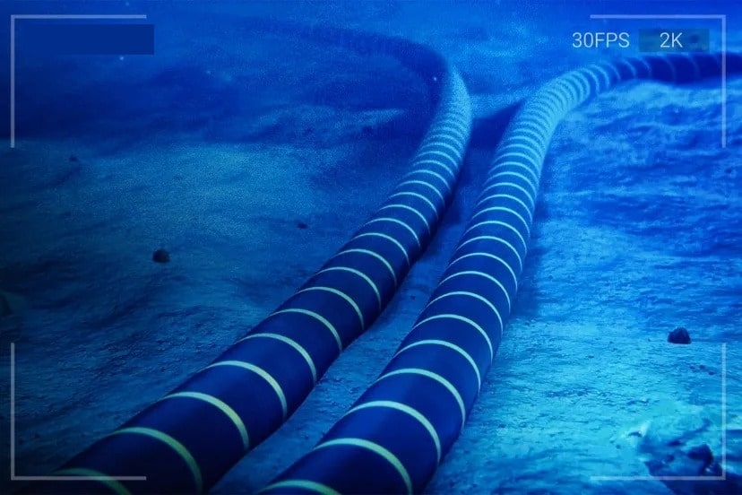
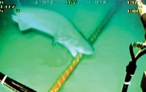

از عمق اقیانوس ها تا سیستم های هوشمند ما.

اینترنت یک **شبکهٔ جهانی از کامپیوترها** است که از طریق **زیرساختهای فیزیکی و پروتکلهای ارتباطی** به هم متصل شده است.

---

## **۱. اینترنت چگونه کار میکند؟**

اینترنت بر اساس **شبکهای از شبکهها (Network of Networks)** کار میکند. هر دستگاه (مثل موبایل، لپتاپ، سرور) با استفاده از **آدرس IP** شناسایی میشود و دادهها از طریق **مسیریابها (Router)** و **سوئیچها (Switch)** بین شبکهها جابهجا میشوند.

- **پروتکلهای اصلی:**
    
    - **TCP/IP**: برای انتقال دادهها بین دستگاهها.
        
    - **HTTP/HTTPS**: برای بارگذاری صفحات وب.
        
    - **DNS**: تبدیل نام دامنه (مثل google.com) به آدرس IP.

---

## **۲. اینترنت چگونه به هم متصل شده است؟**

اینترنت از **ترکیب اتصالات مختلف** تشکیل شده است:

### **الف) کابلهای زیردریایی (Submarine Cables)**

✅ **بله، درست شنیدید! بیشتر ترافیک اینترنت جهانی از طریق کابلهای نوری (فیبر نوری) در کف اقیانوسها منتقل میشود.**

- **چرا کابلهای زیردریایی؟** چون انتقال داده از طریق فیبر نوری **سریعتر و پایدارتر** از ماهواره است.
    
- **طول کابلها:** بیش از **۱.۳ میلیون کیلومتر** کابل در اقیانوسها وجود دارد!
    
- **مثال:** کابل **"MAREA"** بین آمریکا و اسپانیا، با پهنای باند **۱۶۰ ترابیت بر ثانیه!**

### **✔️ مزایا:**

- **پوشش جهانی:** حتی در بیابانها و اقیانوسها کار میکند.
    
- **راهاندازی سریع:** نیازی به کابلکشی نیست.
    

### ❌**معایب:**

- **تأخیر (Latency) بالا:** حدود **۲۰ تا ۴۰ میلیثانیه** (در مقایسه با کابلهای زیردریایی با **۵ تا ۱۰ میلیثانیه**).
    
- **سرعت پایینتر:** حداکثر **۱ گیگابیت بر ثانیه** (در مقایسه با **ترابیتها** در فیبر نوری).
    
- **هزینه زیاد:** تجهیزات گیرنده گران هستند.

---

### **ب) اتصالات زمینی (فیبر نوری، مایکروویو، ماهواره)**

- **فیبر نوری در خشکی:** بین شهرها و کشورها.
    
- **مایکروویو (بیسیم):** در برخی مناطق کوهستانی یا روستایی.
    
- **ماهوارهها (مثل استارلینک):** برای مناطق دورافتاده، ولی **سرعت و تأخیر بیشتری** دارند.

- ### ✔️ **مزایا:**

- **پوشش جهانی:** حتی در بیابانها و اقیانوسها کار میکند.
    
- **راهاندازی سریع:** نیازی به کابلکشی نیست.
    

### ❌**معایب:**

- **تأخیر (Latency) بالا:** حدود **۲۰ تا ۴۰ میلیثانیه** (در مقایسه با کابلهای زیردریایی با **۵ تا ۱۰ میلیثانیه**).
    
- **سرعت پایینتر:** حداکثر **۱ گیگابیت بر ثانیه** (در مقایسه با **ترابیتها** در فیبر نوری).
    
- **هزینه زیاد:** تجهیزات گیرنده گران هستند.

#### **ج) مراکز داده (Data Centers) و IXP ها**

- **IXP (Internet Exchange Point):** نقاطی که شبکه های مختلف برای تبادل ترافیک به هم متصل میشوند (مثل **DE-CIX** در آلمان، یکی از بزرگترین IXPهای جهان).
    
- **سرورهای کلود (مثل آمازون، گوگل):** دادهها را در سراسر جهان ذخیره و منتقل میکنند.

---

## **۳. آیا اینترنت بدون کابل کار میکند؟**

- **خیر! حتی وایفای و موبایل دیتا هم در نهایت به کابلهای فیزیکی متصل هستند.**
    
    - مثلاً وقتی با موبایل به اینترنت وصل میشوید، دادهها از طریق **دکل مخابراتی → فیبر نوری → کابلهای زیردریایی** به مقصد میرسند.
        
    - **ماهوارهها (مثل استارلینک)** جایگزین جزئی هستند، ولی هنوز بیشتر ترافیک از کابل میگذرد.

---

### **۴. نقشهٔ اینترنت جهانی چگونه است؟**

- سایتهایی مثل **[Submarine Cable Map](https://www.submarinecablemap.com/)**  نشان میدهند که کابلها و شبکه ها چطور جهان را به هم وصل کردهاند.

---

			اطلاعات بیشتر
	

---

## **۱. کابلهای زیردریایی اینترنت چگونه کشیده میشوند؟**  
کشیدن کابلهای اینترنت در کف اقیانوسها یک **فرآیند مهندسی پیچیده و هزینه بر** است. مراحل اصلی آن عبارتند از:  

### **الف) نقشهبرداری از مسیر**  
- قبل از کشیدن کابل، **کف دریا بررسی میشود** تا از مسیرهای امن (بدون صخرههای تیز، گسلهای فعال یا کشتیهای غرقشده) استفاده شود.  

### **ب) کشتیهای مخصوص (کشتیهای کابلگذاری)**  
- این کشتیها مجهز به **دستگاههای غولپیکر کابلگذاری** هستند و کابل را به آرامی در کف دریا قرار میدهند.  
- برخی کابلها **دفن میشوند** تا از آسیب ماهیها یا لنگر کشتیها در امان بمانند.  

### **ج) ساختار کابلهای زیردریایی**  
- **فیبر نوری:** هسته اصلی انتقال داده با **سرعت نور**!  
- **لایههای محافظ:**  
  - **پلاستیک مقاوم** در برابر آب شور.  
  - **محافظ فولادی** برای جلوگیری از حمله کوسهها (!) و فشار آب.  
  - **عایقهای مخصوص** برای جلوگیری از قطعی بر اثر امواج یا زمینلرزه.  

### **د) هزینه و زمان اجرا**  
- **هر کابل بین ۱۰۰ میلیون تا ۵۰۰ میلیون دلار** هزینه دارد!  
- **مدت اجرا:** چند ماه تا چند سال (بسته به مسافت).  

---

## **۲. آیا کابلهای اینترنت قطع میشوند؟**  
✅ **بله! قطعی کابلها اتفاقی رایج است.** دلایل اصلی:  
- **طبیعی:** زمینلرزه، سونامی، جریانهای شدید آب.  
- **انسانی:** لنگر کشتیها، ماهیگیری غیرقانونی، خرابکاری (مثل قطعی عمدی در یمن).  
- **حیوانات:** گاهی **کوسه ها کابل را گاز میگیرند**! (برای همین محافظ فولادی دارند.)  

### **چگونه تعمیر میشوند؟**  
- **کشتیهای تعمیراتی** کابل را از آب بیرون میکشند و قسمت آسیب دیده را تعویض میکنند.  
- **تعمیر یک کابل ممکن است هفتهها طول بکشد.**  

---

## **۳. سرعت انتقال داده در کابلهای زیردریایی چقدر است؟**  
- **کابلهای مدرن:** تا **۲۰۰ ترابیت بر ثانیه** (مثل کابل **"Marea"** بین آمریکا و اروپا).  
- **معمولاً:** بین **۱۰ تا ۱۰۰ ترابیت بر ثانیه**.  
- **مقایسه:**  
  - **فیبر نوری زیردریایی** ≈ **۱۰۰,۰۰۰ برابر سریعتر** از اینترنت خانگی معمولی!  
  - **ماهواره (مثل استارلینک):** حداکثر **۱ گیگابیت بر ثانیه** با تأخیر بیشتر.  

---

## **۴. چند درصد جهان از کابلهای زیردریایی استفاده میکند؟**  
- **۹۹% ترافیک بینالمللی اینترنت** از طریق کابلهای زیردریایی منتقل میشود!  
- **۱% باقیمانده:** ماهوارهها (مثل استارلینک) که برای مناطق دورافتاده یا کشورهای تحریمشده (مثل ایران در برخی موارد) استفاده میشوند.  

---

## **جمعبندی:**  
🌍 **۹۹% اینترنت جهان از کابلهای زیردریایی میگذرد** – این کابلها با **سرعت ترابیتی** دادهها را منتقل میکنند.  
🛰️ **ماهوارهها (مثل استارلینک) فقط ۱% ترافیک را پوشش میدهند** و برای مناطق دورافتاده مفیدند.  
⚡ **قطع شدن کابلها اتفاق میافتد** و تعمیر آنها هفتهها طول میکشد.  
🦈 **کوسهها گاهی کابلها را گاز میگیرند!** (بله، واقعیت دارد!)  
